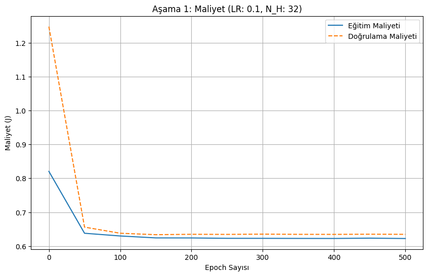

Şimdi Ne Yapmalıyız? (Tavana Ulaştık mı?)
%63.17 ve %63.10 sonuçlarının birbirine bu kadar yakın olması (istatistiksel olarak "aynı" olmaları), bize şunu gösteriyor: Mevcut özelliklerimiz ve mevcut mimarimizle, bu problemin doğal bir tavanına (%63 civarı) ulaştık.

Artık doğruluğu artırmanın yolu, epoch sayılarıyla veya veri setlerini birleştirmekle oynamak değil. Modelin öğrenme şeklini temelden iyileştirmemiz gerekiyor.

İşte %63 tavanını kırmak için iki yeni (ve son) fikrim var:

Düzenlileştirme (Regularization): Modelin "ezberlemesini" (overfitting) zorlaştırmak.

Daha İyi Normalleştirme: Modelin "öğrenmesini" kolaylaştırmak.

Seçenek 1: L2 Düzenlileştirme (Regularization) Eklemek
Aşırı öğrenmeyi (overfitting) durdurmanın en standart yolu budur. compute_cost fonksiyonumuza modelin ağırlıklarını "cezalandıran" küçük bir terim ekleriz. Bu, modelin daha "genel" şeyler öğrenmesini ve ezberlemesini engeller. Bu, "Erken Durdurma"ya (Aşama 1) yardımcı olur.

Seçenek 2 (Daha Kolay ve Etkili Olabilir): StandardScaler Kullanmak
Şu an verilerimizi X / X_max ile normalize ediyoruz (0 ile 1 arasına sıkıştırıyoruz). Bu, rank_points (çoğu 0'a yakın) ve age (çoğu 0'a yakın) için kötü bir yöntem olabilir.

Sinir ağları, ortalaması 0 ve standart sapması 1 olan verilerle (StandardScaler yöntemi) çok daha iyi çalışır. Bu, öğrenmeyi hızlandırır ve modelin yerel minimumlara takılmasını engeller. Bu, veri hazırlama (# 7. Normalleştirme) adımımızı değiştirmemizi gerektirir.

Öneri: "Aşama 2" tuzağını öğrendik. Şimdi "Aşama 1"e (Train/Val ayrımı + Erken Durdurma) geri dönelim ve modeli daha akıllı hale getirelim.

StandardScaler'ı (Seçenek 2) denemek ister misiniz? Bu, normalleştirme adımında basit bir değişiklik gerektirir ancak öğrenme kalitesini ciddi şekilde artırabilir.

--------------------------------------------------------------------------------

Henüz Eklemediğimiz Ama Ekleyebileceğimiz Şeyler
İşte %63'lük tavanı kırmamıza yardımcı olabilecek, henüz kodumuzda olmayan 3 güçlü teknik:

L2 Düzenlileştirme (L2 Regularization):

Nedir? compute_cost fonksiyonuna, tüm ağırlıkların (W1, W2) kareleriyle orantılı küçük bir "ceza" terimi ekleriz.

Etkisi: Modelin "aşırı öğrenmesini" (overfitting) engeller. Ağırlıkların çok büyümesini (ezberlemeyi) engeller ve daha "genel" kurallar öğrenmeye zorlar. "Erken Durdurma"nın (Early Stopping) daha geç tetiklenmesini ve potansiyel olarak daha iyi bir doğrulukta durmasını sağlayabilirdi.

Dropout:

Nedir? Eğitim sırasında (forward_propagation'da), her adımda rastgele olarak bazı nöronları (örn: %20'sini) "kapatır" (sıfırlar).

Etkisi: Modelin tek bir "süperstar" nörona veya özelliğe aşırı güvenmesini engeller. Ağı daha "dayanıklı" (robust) hale getirir. L2 gibi, bu da overfitting ile savaşmanın çok güçlü bir yoludur.

Mini-Batch Gradient Descent:

Nedir? Şu an tüm 97,000 örneği (X_train) tek bir dev "batch" (parti) olarak işleyip 1 güncelleme yapıyoruz. Bu yavaştır.

Bunun yerine, 97,000 örneği 128'erlik "mini-batch"lere (küçük partiler) bölebiliriz. 1 epoch, artık 1 güncelleme değil, (97000 / 128) ≈ 758 güncelleme anlamına gelir.

Etkisi:

Hız: Öğrenme çok hızlanır.

Performans: Her güncellemedeki hafif "gürültü", modelin kötü "yerel minimumlara" (local minima) takılıp kalmasını engeller ve genellikle daha iyi bir nihai sonuç bulmasını sağlar.

Özetle: Modelimizin %63'te kalmasının nedeni, "Dağılım Kayması" (Distribution Shift) sorununa ek olarak, "overfitting" ile savaşmak (L2, Dropout) ve "optimizasyonu" iyileştirmek (Adam, Mini-Batch) için bu modern teknikleri henüz uygulamamış olmamızdır.

-----------------------------------------------

1HLayer_ANN modelini LRelu aktivasyon fonksiyonu he başlatması ve adam optimizasyonu eklenince optimum tahminin 2500 epochtan 600 epoch'a düşmesi modelin hızlandığını gösteriyor.

2HLayer_ANN modelini LRelu aktivasyon fonksiyonu he başlatması ve adam optimizasyonu ekle bu şekilde daha hızlı eğitim yapabilir ve tanh ile yaşadığımız 17dk lık eğitim süresini düşürmeyi başarmış oluruz.

------------------------------------------------

1HLayer_ANN modeline R2 regularization eklendiğinde elle tutulur bir gelişim olmadığını gördüm bunun sebebi verilerin basitliğinden kaynaklanıyor olabilir. Çünkü grafiği incelediğimde grafik belirli bir yere kadar eğimli ardından yatay seyrediyor, 

burada yapmam gerekenin verideki özellikleri arttırıp daha işe yarayabilecek veriler eklemek olabilir. Bir diğer denemek istediğim şey ise bu modeldeki gizli katman sayısını arttırmak. Bu ikisini bir yaparsam %63.8 olan gördüğüm en yüksek değeri aşabilirim. Daha karmaşık veri ve daha fazla gizli katman daha karmaşık ilişkileri öğrenebilir. 

-------------------------------------------------

2HLayer_ANN_Notebook_L2Optimization_LRelu.ipynb dosyası şuan 1HLayer_ANN_Notebook_L2Optimization ile aynı buna sadece yeni gizli katman eklenecek.

-------------------------------------------------

Sentetik veri seti toolarını araştır. (smothie yöntemi) smothe 